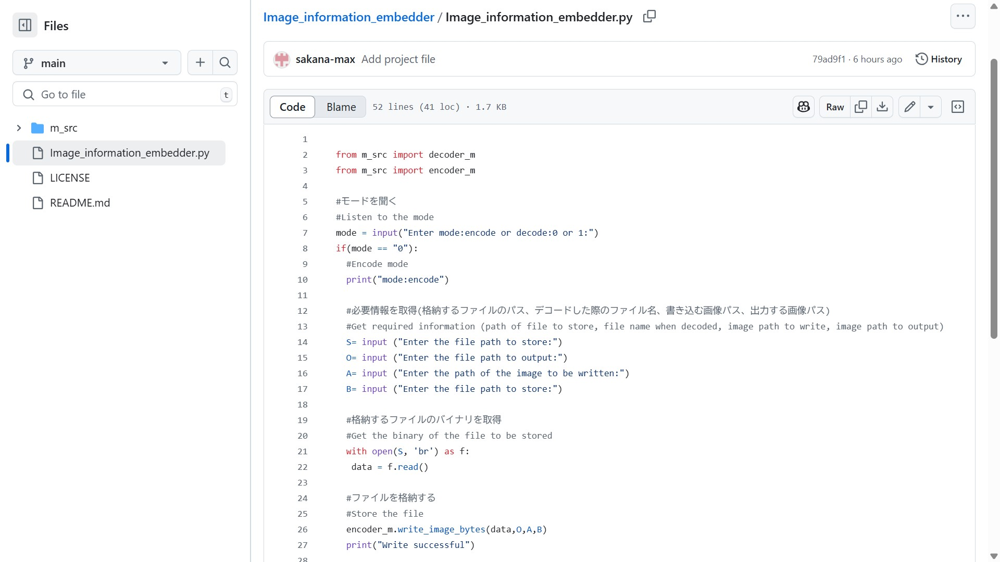

# Image_information_embedder

## Overview
This project allows you to embed any file without distorting the image.

The following image contains a text file: [The file being written(testImage/Hello.txt)](testImage/Hello.txt)

### Details
Records and reads 0 and 1 according to the even and odd RGB numbers of the image. (LSB conversion)

This allows you to embed and read any file into an image.

You can also record the filename along with the file's binary, so you can automatically record the filename and extension when reading it.

~~*Note: If there is a file with the same name as the output file, it will be overwritten. Please be careful.~~　Improved
### update
A GUI environment has been added.

This has improved the UX.

If you are using the old CUI environment, please refer to README.md in the "old" file. The license is the same, but the content may be outdated.

Please rest assured that the output files are compatible.
## Usage (general users)
*This is an explanation for the new GUI. If you are using the old CUI environment, please refer to the README.md file in the "old" file.
### Installation

Download the latest release.

## Usage
Run "Image_information_embedder_GUI.exe" included in the release in zip file.

## Setting the mode

When it starts, enter the following

### Set the mode

Select decode mode (read) or decode mode (write).

After setting the two buttons, press the "Decision" button to confirm.

### If you set the encoding mode

Four input tabs will appear.

From the top, they are

1 Enter the file name to embed (file can be referenced)

2 Enter the file name when output

3 Enter the image file name to write (file can be referenced)

4 Enter the image file name to output

When you have entered everything correctly, press the "Decision" button to confirm.

When "Writing successful" is displayed under that button, it is complete.

### If you set the decoding mode

One input tab will appear.

To do this, select the name of the image file to read. (File can be referenced)

When you have entered everything correctly, press the "Decision" button to confirm.

When "Saving successful" appears below the button, the process is complete.

### *You may be asked to confirm whether you want to overwrite the file during the process.

If this happens, simply press the "Decision" button again to confirm if you want to overwrite the file, or if you want to change the file name, change or enter the 

output name and then press the "Decision" button to confirm.

## How to use (Developer)
Download with the green button in the upper right.
### Prerequisites
Python must be installed
### Install dependencies
This project depends on the Python module (Pillow).

To install, run

```sh
pip install Pillow
```

.
### How to run

Execute Image_information_embedder_GUI.py.

The general method is to go to the downloaded directory and run

```sh
python Image_information_embedder_GUI.py
```


## Translation

This explanation and the program comments are machine translated from Japanese.

There may be undesirable or incorrect expressions.

If so, please report it with "lssues".

## License

This project is licensed under the MIT License. See the [LICENSE](LICENSE) file for more details.
